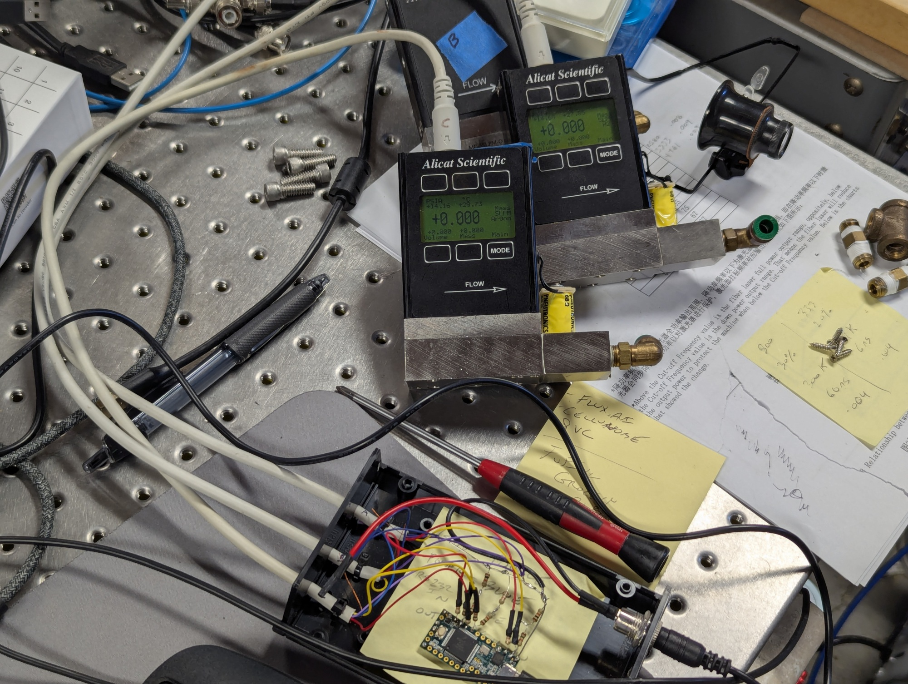
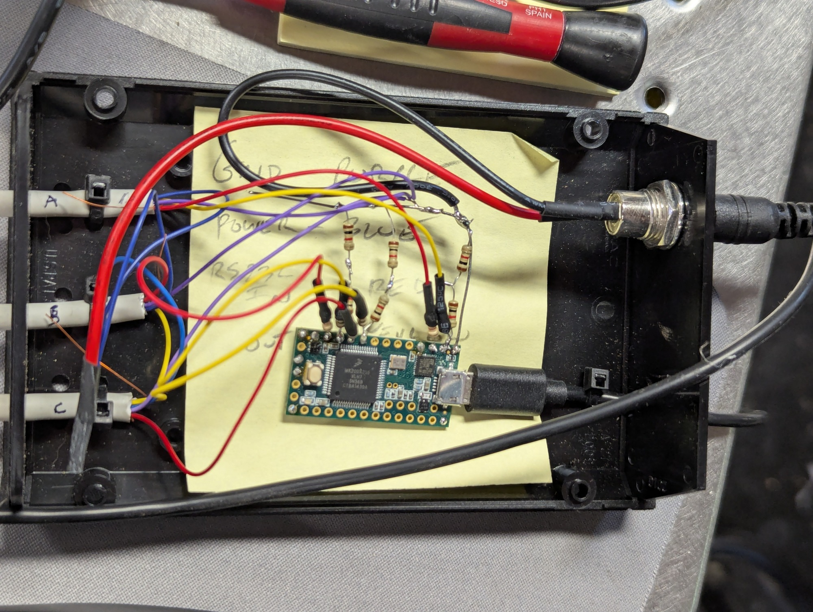

# Alicat_mass_flow_controller_arduino
Arduino (Teensy) firmware to control three Alicat "GP" firmware mass flow controllers (MFC)

These are old Alicat mass flow controllers, which are so old, they do not quite follow the specification currently published by Alicat.  As far as I can tell, they only will accept a flow control integer.  No other functions (gas type, etc) can be changed via RS232.  Gas type can be changed via the front panel buttons, and will remain after a power cycle.

I used a separate serial port for each controller because they also do not respond to ID commands as expected.  I also had to have a separate physical wire for each one, and the Teensy 3.2 conveniently has three separate ports, so it was the same circuitry.

The "tare" command doesn't work as described in the specification.  Instead, send a "0" flow condition.  The MFC will close the valve, and tare the reading.

Video showing these controllers in use
https://www.youtube.com/watch?v=ih_D6OLzqo4

Alicat documentation
https://documents.alicat.com/manuals/DOC-MANUAL-MC.pdf
https://documents.alicat.com/Alicat-Serial-Primer.pdf

